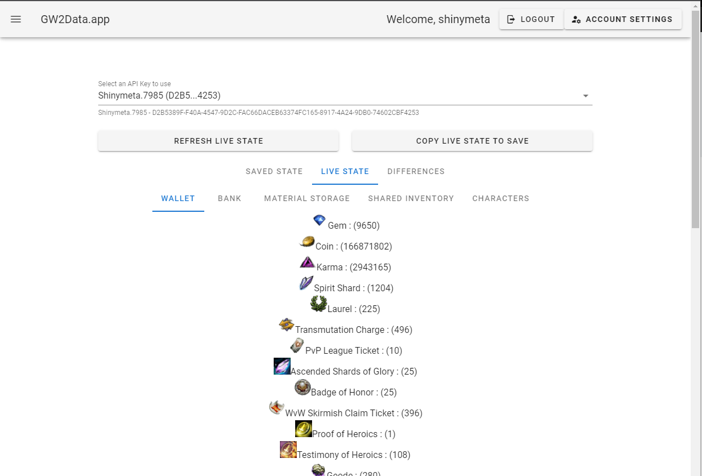
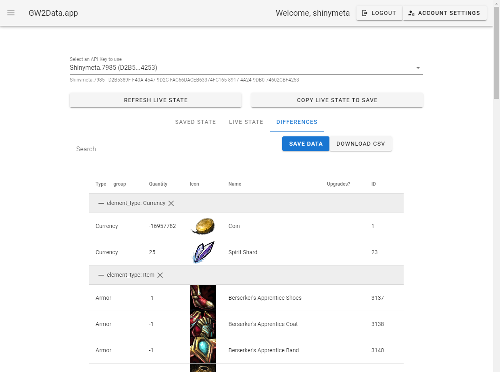
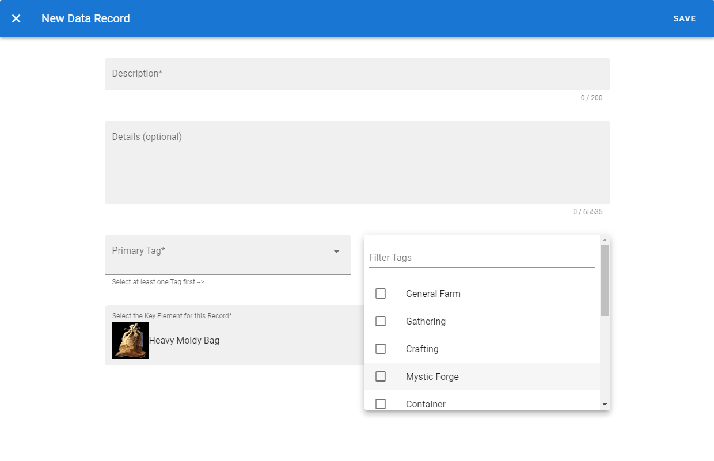
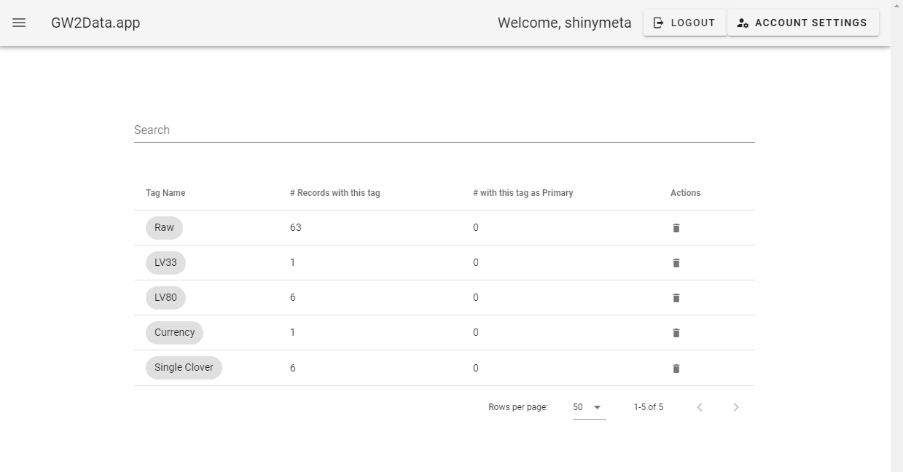
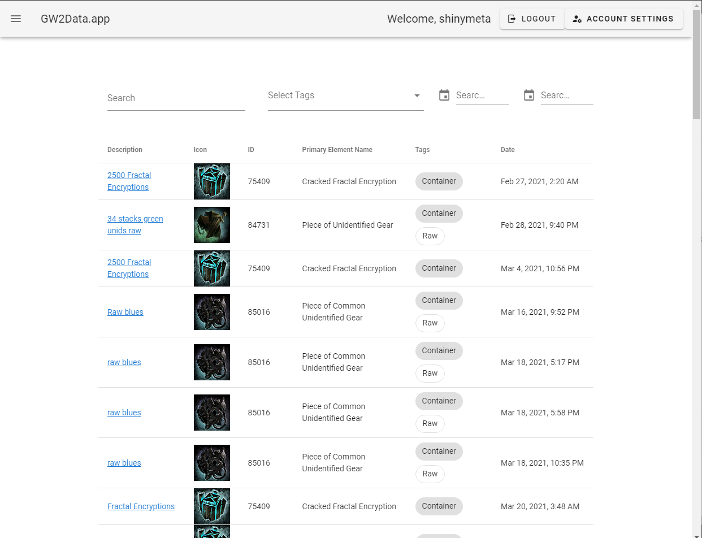
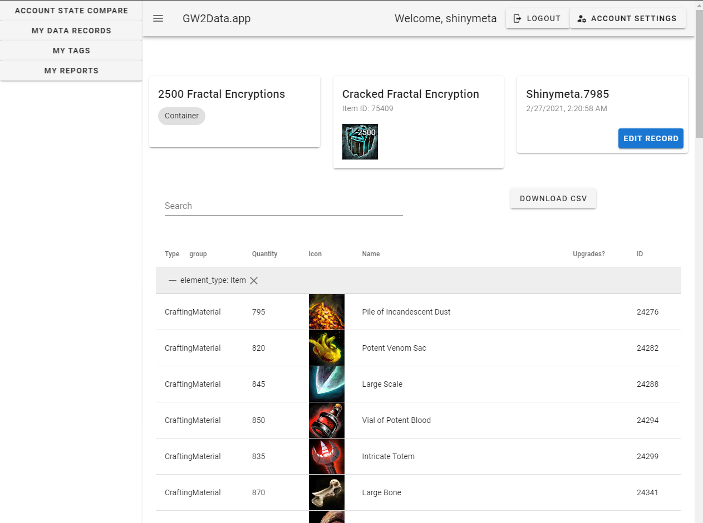
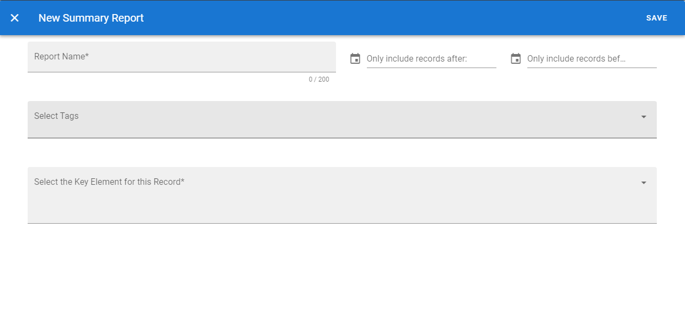

# gw2data.app

Gw2data.app is a tool used to collect large sets of item data via the official GW2 api.  The tool captures "snapshots" or "states" of the entire User's Account, and compares them for differences.  These differences can be downloaded as csv or saved to the tool's cloud storage for later reference, download and summary with other records in reports.

## Account State Compare

The **Account State Compare** page is used to create new records.  There are three tabs, **Saved State** and *Live State* (which refer to the full account snapshots) and **Differences** (which shows the net differences between the saved and live states).  The State tabs can be browsed to visually understand the state being returned by the API and where differences are detected.  The **Differences** Tab provides the CSV download button as well as a Save Data button, which saves the contents of the differences table as a new record to the cloud storage for the user's account.

## My Tags

Users can tag data records with common pre-set tags or custom tags.  This allows for easier filtering for searches and reporting later.  From **My Tags** users can manage their custom tags, and get some information about their usage.

## My Data Records

All previously saved records can be searched and reviewedfrom the **My Data Records** page.  Clicking the Description text will open the detail page which shows the difference table and other details about the recorded record, and the ability to edit descriptions and tags.

## My Reports

Summary reports on the **My Reports** page allow users to specify filters/search parameters to combine the totals from multiple records into a single report.  When viewing a report, the same table format and downlod CSV button is available, as well as another tab containing a table of source records used in the report.

